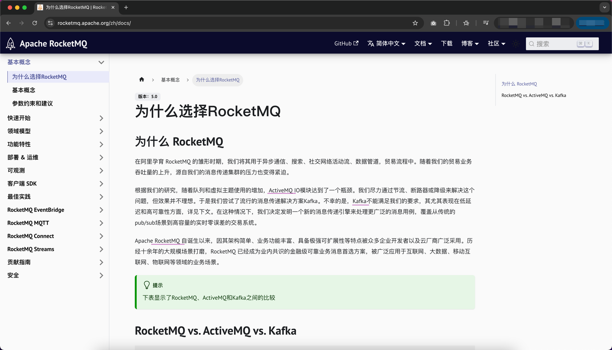
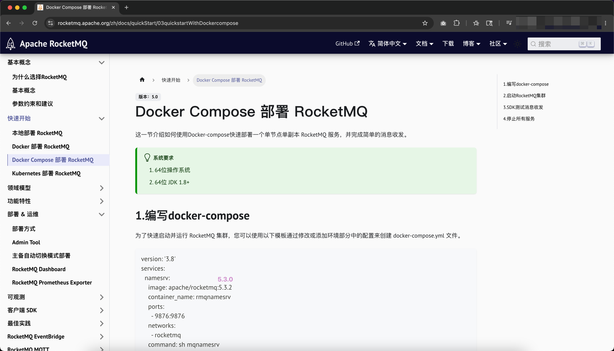
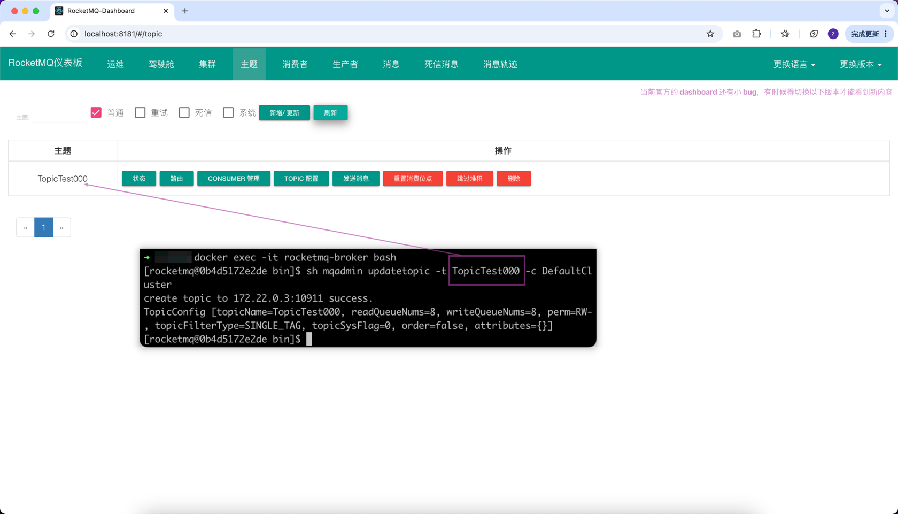
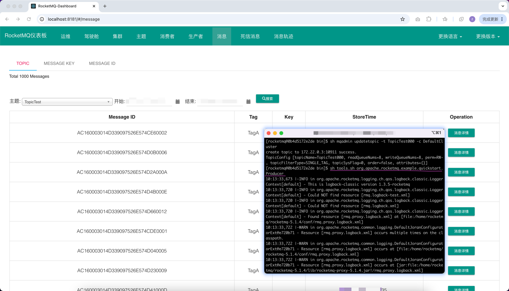
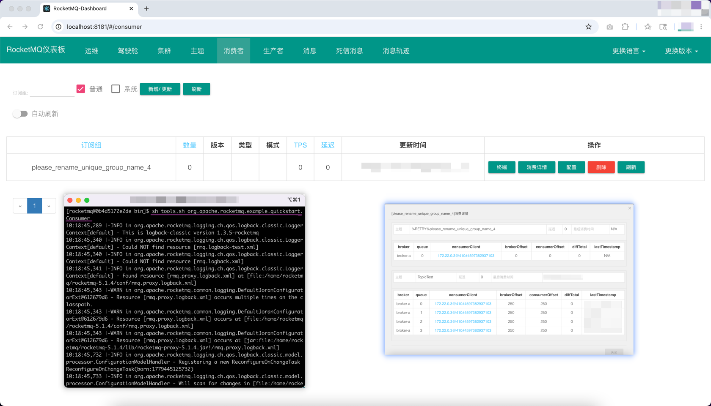

## 关于消息队列 MQ
### 为什么用 MQ

- 异步
- 解耦
- 削峰
- ...

### 日常生活中的场景

- ...

## 为什么选择 RocketMQ
RocketMQ vs. ActiveMQ vs. Kafka

https://rocketmq.apache.org/zh/docs/



## Docker Compose 部署 RocketMQ
- 以 5.3.0 为例
- 

### 编写 docker-compose
- 见课上分享的 `docker-compose.yml`

### 启动 RocketMQ 集群
根据 docker-compose.yml 文件启动所有定义的服务。
```shell
docker-compose -f 你的存放目录/docker-compose.yml up -d
```

### 测试
#### 进入 broker 容器
```shell
docker exec -it rocketmq-broker bash
```

#### 通过 mqadmin 脚本工具创建名称为“TopicTest000”的 Topic
```shell
sh mqadmin updatetopic -t TopicTest000 -c DefaultCluster
```
- 

#### 通过 tools.sh 脚本工具测试消息发送消息（1000 条）
```shell
sh tools.sh org.apache.rocketmq.example.quickstart.Producer
```
- 

#### 通过 tools.sh 脚本工具测试消息接收消息（1000 条）
```shell
sh tools.sh org.apache.rocketmq.example.quickstart.Consumer
```
- 

### 停止 RocketMQ 集群
docker-compose down
