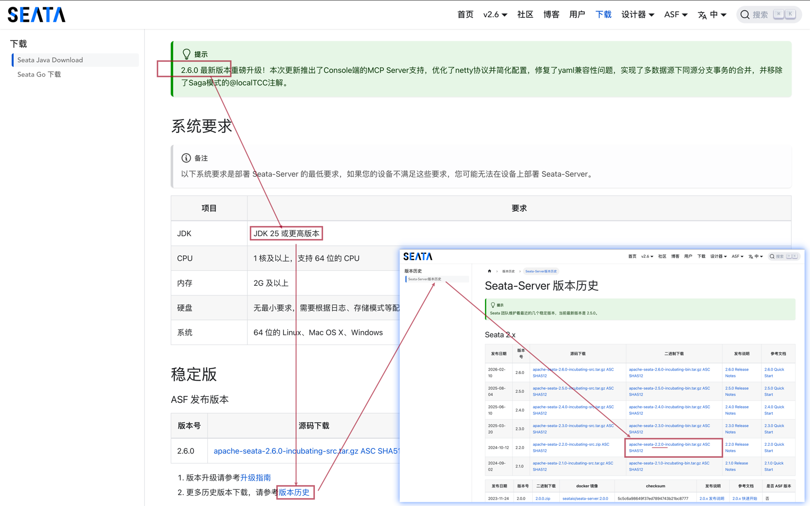

## 分布式事务组件 - Seata
### Seata 是什么?
- https://seata.apache.org/zh-cn/docs/overview/what-is-seata

### 下载
- https://seata.apache.org/zh-cn/download/seata-server
- 

### 启动
- 启动前的准备：增加 Seata AT 模式需要用到的回滚日志记录表 `undo_log`
```sql
CREATE TABLE `undo_log`
(
    `id`            bigint(20)   NOT NULL AUTO_INCREMENT,
    `branch_id`     bigint(20)   NOT NULL,
    `xid`           varchar(100) NOT NULL,
    `context`       varchar(128) NOT NULL,
    `rollback_info` longblob     NOT NULL,
    `log_status`    int(11)      NOT NULL,
    `log_created`   datetime     NOT NULL,
    `log_modified`  datetime     NOT NULL,
    `ext`           varchar(100) DEFAULT NULL,
    PRIMARY KEY (`id`),
    UNIQUE KEY `ux_undo_log` (`xid`, `branch_id`)
) ENGINE=InnoDB AUTO_INCREMENT=1 DEFAULT CHARSET=utf8;
```
- 启动
https://seata.apache.org/zh-cn/docs/ops/deploy-server
```shell
# windows
cd 你解压的位置/apache-seata-2.2.0-incubating-bin/seata-server
bin\seata-server.bat

# Linus or macOS
cd 你解压的位置/apache-seata-2.2.0-incubating-bin/seata-server
sh ./bin/seata-server.sh
```
