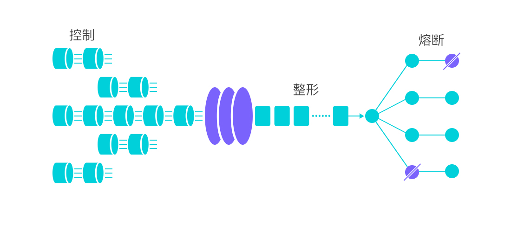
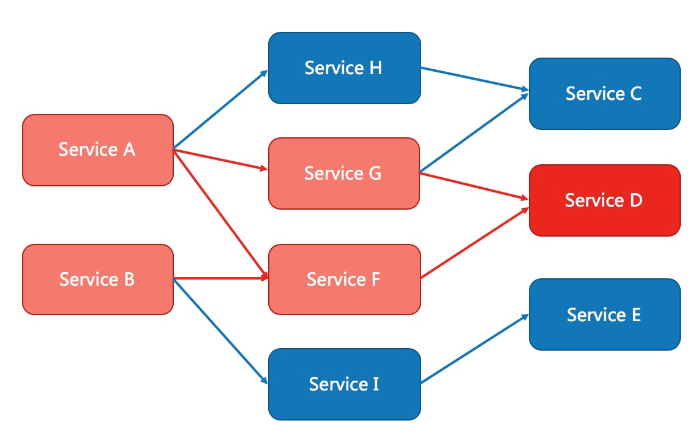

## “代码就是生活” 之 “流量治理”
- 假如你开了一家小吃店，每天都有固定的顾客（流量），突然有一点你上了美食纪录片，火了，如何应对明天的流量？
  - 第一天，可能是：排队、门口等待区放一些椅子零食等等
  - 第二天，可能是：多准备食材、优化排队队形（整形）等等
  - 第三天，可能是：预约、取号等等
- 假如某一天的 xxx 体育馆要开一场 yyy 的演唱会，体育馆及周边会如何控制流量？
  - 预约、卖票
  - 即使卖票，也可能有大批用户
  - jc 对周边路段进行流量管制
  - 甚至临时开通专线列车等等
  - 检票口调整队形，避免太长、拥挤、踩踏等等
- 还记得之前的 “啊～～ hs 检测” 吗？
  - 回想当时的场景：登记、预约、排队（队形、快到的时候一次进去特定几个）、临时增加工作人员等等

## 常见限流算法
- 限流之后进行降级处理

常见限流算法
- 静态窗口限流
- 动态窗口限流
- 漏桶限流
- 令牌桶限流
  - 类似漏桶，都是桶，这不过这个桶放的是令牌，而非直接的流量
- 令牌大闸
  - 令牌的总量有限

## Sentinel 介绍
- https://sentinelguard.io/zh-cn/docs/introduction.html
- /ˈsen.tɪ.nəl/ 哨兵、守卫

随着微服务的流行，服务和服务之间的稳定性变得越来越重要。 Sentinel 是面向分布式、多语言异构化服务架构的流量治理组件，主要以流量为切入点，从流量路由、流量控制、流量整形、熔断降级、系统自适应过载保护、热点流量防护等多个维度来帮助开发者保障微服务的稳定性。

### Sentinel 基本概念
#### 资源
资源是 Sentinel 的关键概念。它可以是 Java 应用程序中的任何内容，例如，由应用程序提供的服务，或由应用程序调用的其它应用提供的服务，甚至可以是一段代码。在接下来的文档中，我们都会用资源来描述代码块。

只要通过 Sentinel API 定义的代码，就是资源，能够被 Sentinel 保护起来。大部分情况下，可以使用方法签名，URL，甚至服务名称作为资源名来标示资源。

#### 规则
围绕资源的实时状态设定的规则，可以包括流量控制规则、熔断降级规则以及系统保护规则。所有规则可以动态实时调整。

### Sentinel 功能和设计理念
#### 流量控制
流量控制在网络传输中是一个常用的概念，它用于调整网络包的发送数据。然而，从系统稳定性角度考虑，在处理请求的速度上，也有非常多的讲究。任意时间到来的请求往往是随机不可控的，而系统的处理能力是有限的。我们需要根据系统的处理能力对流量进行控制。Sentinel 作为一个调配器，可以根据需要把随机的请求调整成合适的形状，如下图所示：

流量控制有以下几个角度:

- 资源的调用关系，例如资源的调用链路，资源和资源之间的关系；
- 运行指标，例如 QPS、线程池、系统负载等；
- 控制的效果，例如直接限流、冷启动、排队等。
- Sentinel 的设计理念是让您自由选择控制的角度，并进行灵活组合，从而达到想要的效果。

#### 熔断降级
除了流量控制以外，降低调用链路中的不稳定资源也是 Sentinel 的使命之一。由于调用关系的复杂性，如果调用链路中的某个资源出现了不稳定，最终会导致请求发生堆积。

当调用链路中某个资源出现不稳定，例如，表现为 timeout，异常比例升高的时候，则对这个资源的调用进行限制，并让请求快速失败，避免影响到其它的资源，最终产生雪崩的效果。

### Sentinel + Nacos
- “规则”持久化到 Nacos
